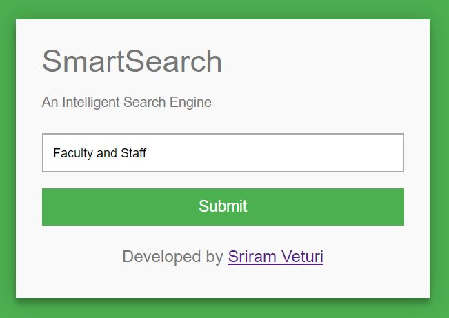
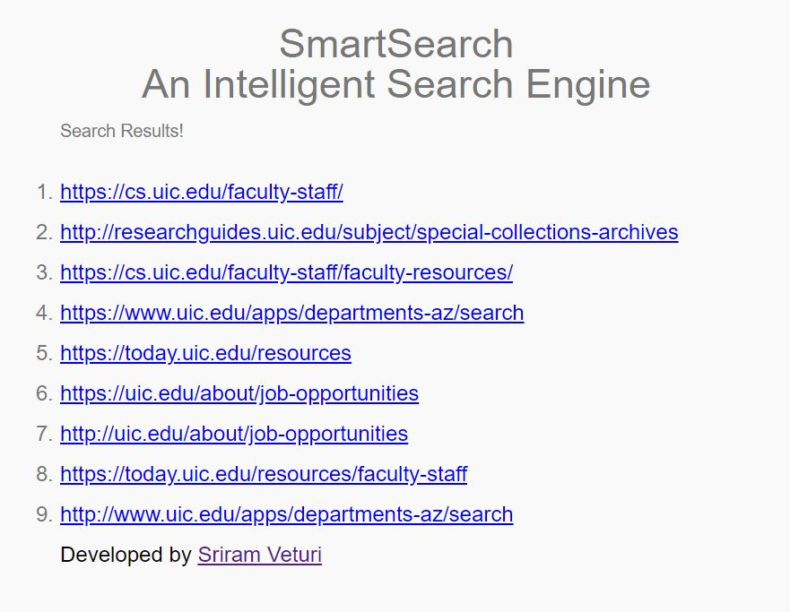

# Smart Search - Intelligent Search Engine.

This project seeks to build a comprehensive and reliable search engine for the University of Illinois at Chicago using various Information Retrieval techniques and algorithms.

<p align="center">
  
</p>
<p align="center">
  
</p>

There are seven major operations involved in getting this search engine up and running.

1) Data Collection - Crawling and Indexing.
2) Data Preprocessing - Text Cleaning.
3) Building Web Graph.
4) Ranking Pages - PageRank Algorithm.
5) Build Vector Space Model.
6) Cosine Similarity - Indexed Pages and User Query. 
7) Get Search Results.

The topics above and steps in building this project are discussed below. The aim of this project is to build a very light but efficient search engine. Make sure you have all the libraries mentioned in the `requirements.txt` file.
 
You can either use the Search Engine right away or you can also build everything from scratch.

Before everything, make sure you have unzipped the `./tf_idf_files/tf.zip` and `./tf_idf_files/tf-idf.zip`, and store the `tf.json` and `tf-idf.json` in the `./tf_idf_files/` directory.

## Use the Search Engine

The user interface is developed using Flask and hosted on the localhost. 

```
python search_engine_web_app.py
```

This command sets up the UI for the search engine where the user can enter the query and get results.
 
 
## Build Everything From Scratch

### Data Collection - Crawling and Indexing

First step is to build the database of indexed pages across the web in `uic` domain.

Close to 5000 pages would be crawled and the text would be extracted from them.

```
python engine.py --initial_url https://www.cs.uic.edu/ \
                 --number_of_pages 5000 \
                 --domain uic.edu
```

`--initial_url`: The initial URL from which the crawling should start.

`--number_of_pages`: Number of pages to crawl. 

`--domain` (optional): The domain in which crawling should happen.

This command creates a `./documents` directory with data from each URL indexed while crawling.


### Data Preprocessing - Text Cleaning

The text extracted from the webpages is preprocessed. The text is extracted from the `<body>` tag of the site and cleaned.

Finally, a corpus for each webpage is created and stored in `JSON` files.

 
### Building Web Graph

While crawling, the list of all outgoing links is recorded from the `<a>` anchor tags across the pages and stored.

From all the outgoing links, a web graph is created in the nested dictionaries form.


### Ranking Pages - PageRank Algorithm

With the web graph created, the rank scores of each page is calculated using the popular PageRank algorithm

```
python web_graph.py
```

This command creates a directory `./web_page_ranks` with page rank scores for each URL in the web graph and stored in a `JSON` format in the same directory. 


### Build Vector Space Model

Using the inverted index, a vector space model is created for the further operations using the TF-IDF scheme and Cosine Similarity.

```
python build_inverted_index.py
```

This command would create a directory `./tf_idf_files` in which the TF-IDF files for the webgraph would be stored in `JSON` format.


### Cosine Similarity - Indexed Pages and User Query

This is probably the most crucial step in the project where the user's query is taken and preprocessed.

The user's query is then used to retrieve the top 200 webpages using Cosine Similarity from the Vector Space Model created in the previous step.

Out of the top 200 pages, top 10 results are filtered out based on the pagerank scores calculated earlier.


### Get Search Results

The user interface is developed using Flask and hosted on the localhost. 

```
python search_engine_web_app.py
```

This command sets up the UI for the search engine where the user can enter the query and get results.


### Data Download

You can download all the data files from the <a href="https://drive.google.com/drive/folders/1Geg_bErxxaOLNiYMLoAnRNfNkTaFE4LR?usp=sharing">link</a>.

